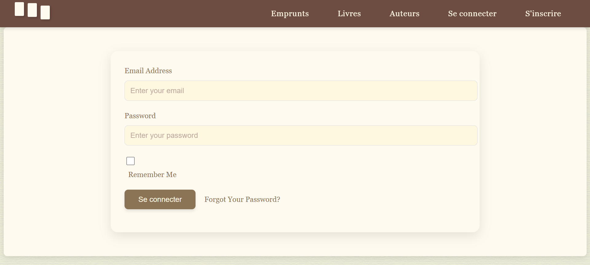
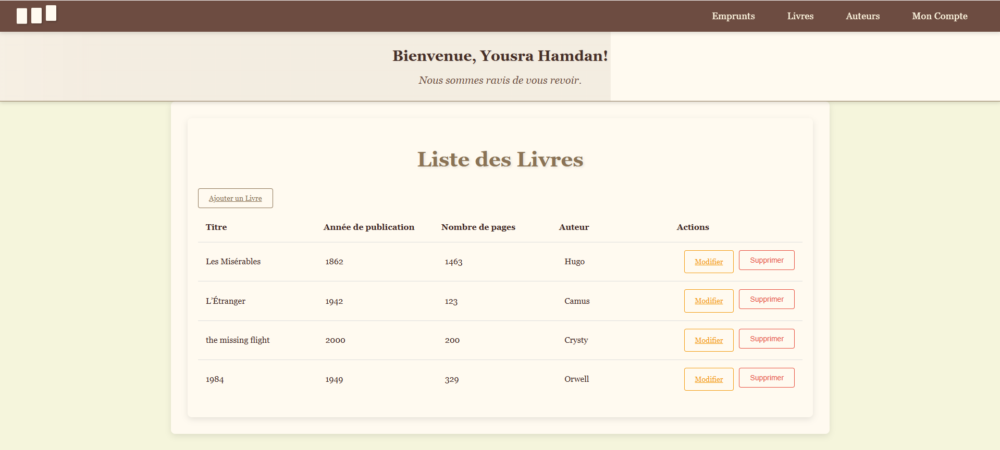
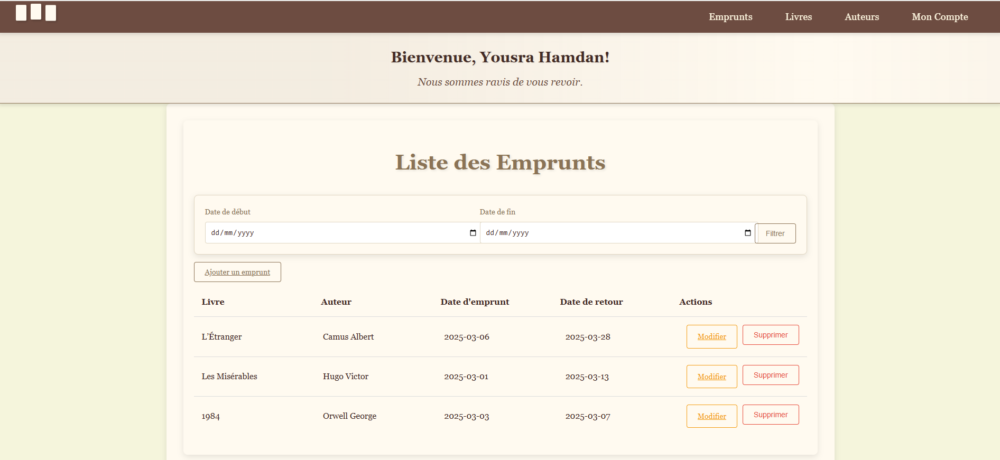
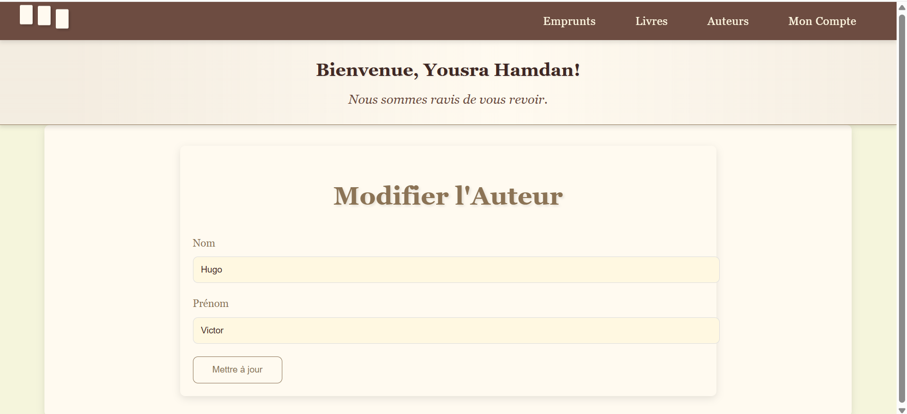
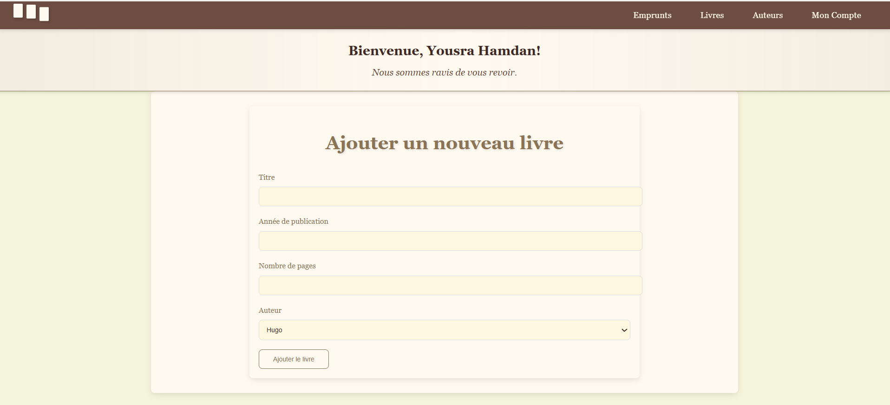
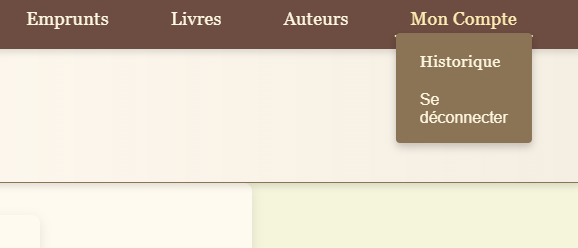

🎨 **UI Preview** :
### 🔐 Login Page


### 🔐 register Page


### 📖 Book Management Page


### 📅 Borrowing System


### writers 


### 📅 forms preview




### navbar states



# 📚 Laravel Library Manager – Your Smart Bookkeeper!  

Welcome to **Laravel Library Manager**, the perfect solution for keeping track of books, authors, and borrowings with ease! Whether you're running a small library or just love organizing your book collection, this system has got you covered.  

## 🚀 What Makes It Special?  
🔐 **Seamless Authentication** – Sign up, log in, and manage your library securely.  
📖 **Effortless Book Management** – Add, edit, and remove books in just a few clicks.  
✍️ **Author Tracking** – Know who wrote what and keep your records clean.  
📅 **Smart Borrowing System** – Monitor book loans and returns with ease.  
📢 **Real-time Change Tracking** – Stay updated with **Laravel Events & Listeners** when books are modified.  

## 💡 Built With  
✨ **Laravel** – A powerful PHP framework for a smooth backend experience.  
🗄️ **MySQL** – Structured database storage for your precious book data.  
📡 **Eloquent ORM** – Making database interactions simple and efficient.  
⚡ **Laravel Events & Listeners** – Ensuring you never miss an update!  

## 🛠️ Get Started in Minutes!  
1️⃣ **Clone the magic** 🪄  
   ```bash
   git clone <your-repo-link>
   cd your-project-folder
   ```  
2️⃣ **Install the essentials** 📦  
   ```bash
   composer install
   ```  
3️⃣ **Set up your secret config** 🔑  
   ```bash
   cp .env.example .env
   php artisan key:generate
   ```  
4️⃣ **Build your database world** 🌍  
   ```bash
   php artisan migrate
   ```  
5️⃣ **Launch the adventure** 🚀  
   ```bash
   php artisan serve
   ```  

## 🔥 Why Use This?  
✔️ No more lost books 📚  
✔️ Keep an eye on every borrowing 🔍  
✔️ Manage authors effortlessly ✨  
✔️ Track every change in real-time 🔔  

📌 **Pro Tip:** Run `php artisan storage:link` if you're handling book images!  

💡 Ready to transform your library management? **Fork it, clone it, and make it your own!** 🚀  

---

Does this vibe with what you're looking for? I can tweak it further if needed! 😊
